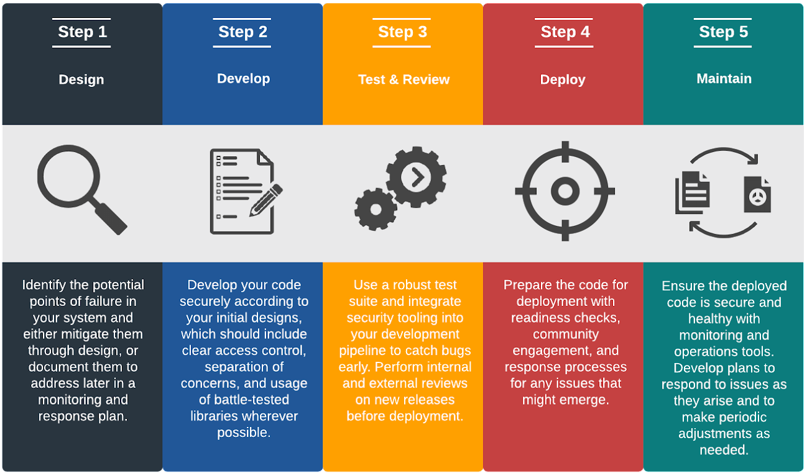

# Smart Contract Security Framework

## Objective

The purpose of this document is to outline the core security fundamentals that Web3 founders, developers, and investors must consider when creating and evaluating a secure smart contract system. This Smart Contract Security Framework discusses eight core categories of security considerations and maps how they should be implemented throughout the Software Development Life Cycle (SDLC). Each category is broken down into three helpful sections by key questions: what, why, and how.

Development Phases (SDLC)

1. **Design**. Developers describe the system's desired features and operations.
2. **Develop**. Developers write the system’s code.
3. **Test & Review**. Developers bring all modules together in a testing environment and check them.
4. **Deploy**. Developers put the system into production.
5. **Maintain**. Developers assess and modify the system to ensure that it is performing its intended functions.

In the figure below, security considerations are mapped onto these five phases.

It is important to note that development life cycles might not always follow a linear path. These steps may be repeated for every release. Some tasks—such as testing and security reviews— may also be performed throughout the development life cycle. The diagrams in the sections that follow are intended to emphasize certain portions of the SDLC, but these categories may overlap or extend to additional phases in practice. New developers should consult established experts with any questions.

## Security Considerations

To assist development teams in taking concrete steps to promote security throughout the SDLC, this Framework organizes security considerations into eight categories, outlined in the sections below.

1. [Threat Modeling & Security Design](threat-modeling-security-design.md)
2. [Reusable Templates & Integrations](reusable-templates-integrations.md)
3. [Administration & Access Control](administration-access-control.md)
4. [Testing & Documentation](testing-documentation.md)
5. [Internal Reviews & Security Audits](internal-reviews-security-audits.md)
6. [Real-Time Monitoring](real-time-monitoring.md)
7. [Incentivizing Community Engagement](incentivizing-community-engagement.md)
8. [Incident & Emergency Response Operations](incident-emergency-response-operations.md)

## Going Forward

It is important to recognize that security considerations are an integral part of successful development — not an add-on. This guide is intended to provide those building Web3 protocols with helpful guidance and resources. However, no short overview can provide an exhaustive discussion of all aspects of smart contract security. Teams lacking in-house security expertise are encouraged to reach out to qualified Web3 security experts who can assist them in applying the general guidance above to their specific situations.
